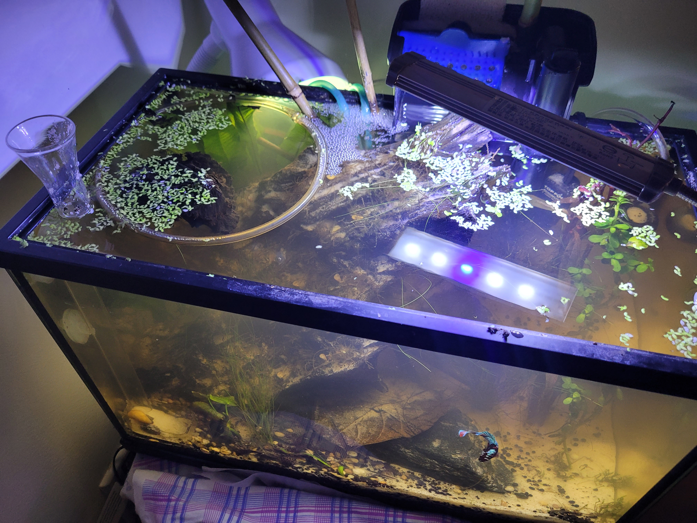
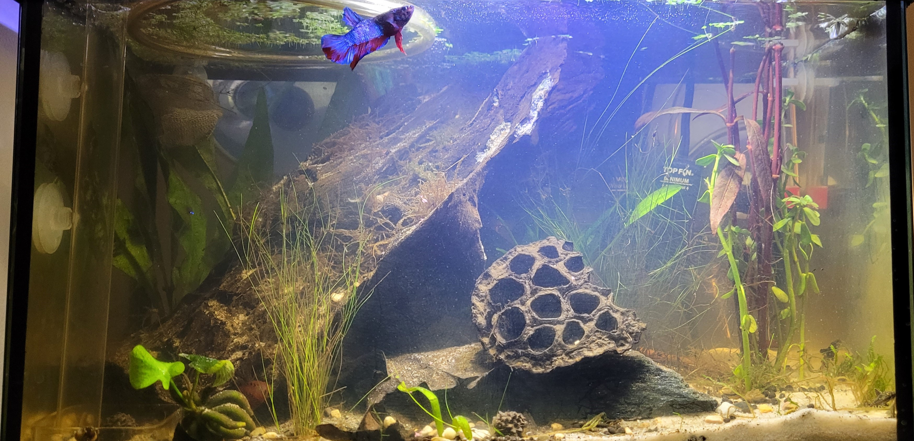
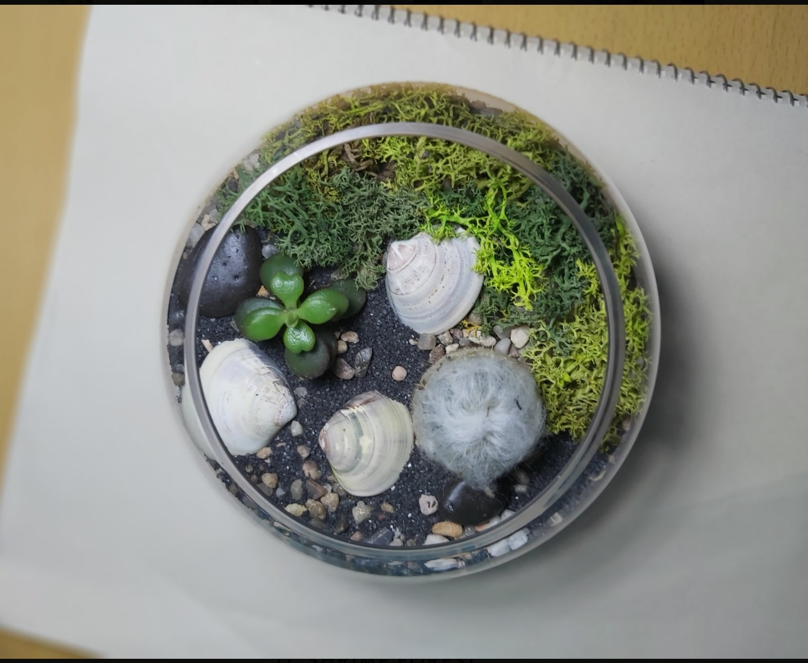
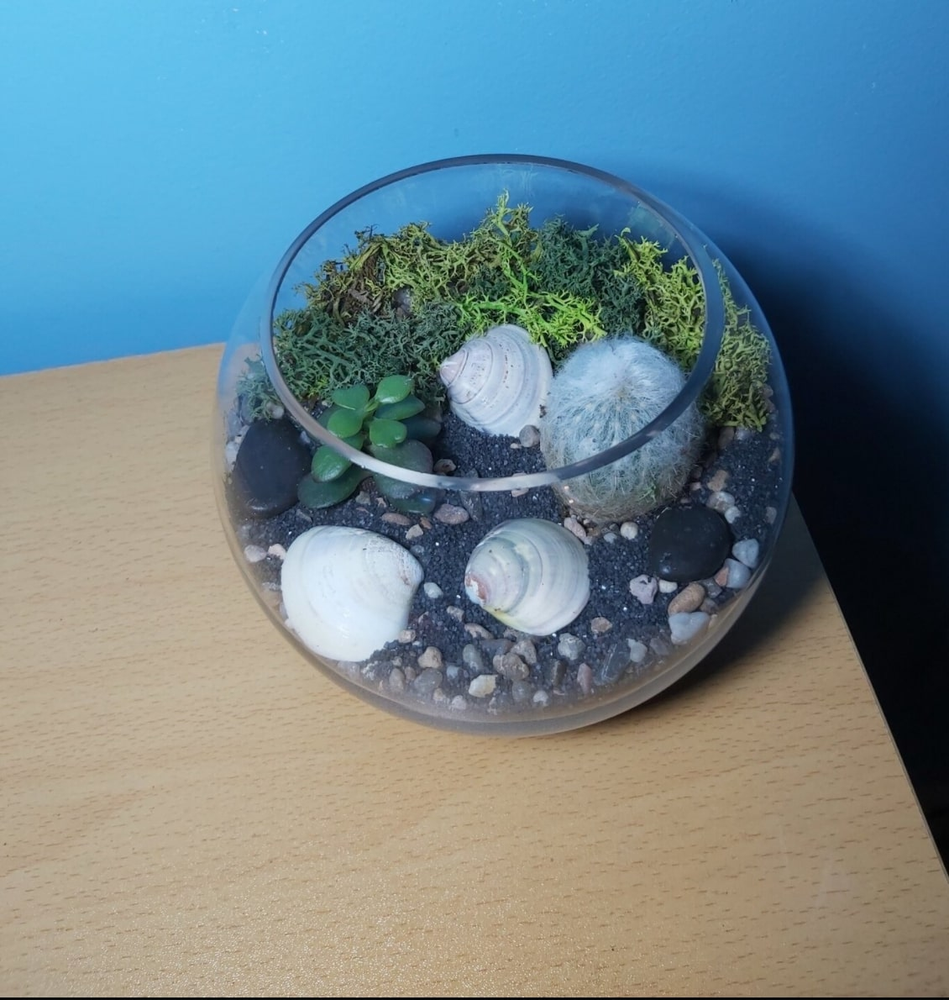

&nbsp;
# _Built Environments_
 &nbsp;

&nbsp;

&nbsp;

&nbsp;

Here I have a project where I designed an environment with live plants in order to house a Betta Fish and Cherry Shrimp. My main challenge was to create a functioning environment in a small space (5 gallons.) It is more difficult to maintain cleanliness in smaller water volumes so I relied heavily on water flow and plants to keep the water clean.
&nbsp;
&nbsp;
&nbsp;
&nbsp;

&nbsp;

&nbsp;

&nbsp;

Here I have a planted bowl housing succulents and moss, it has a base of charcoal, with dirt and sand above it to provide a stable and nutrient rich substrate for the plants, along with moisture retention. 