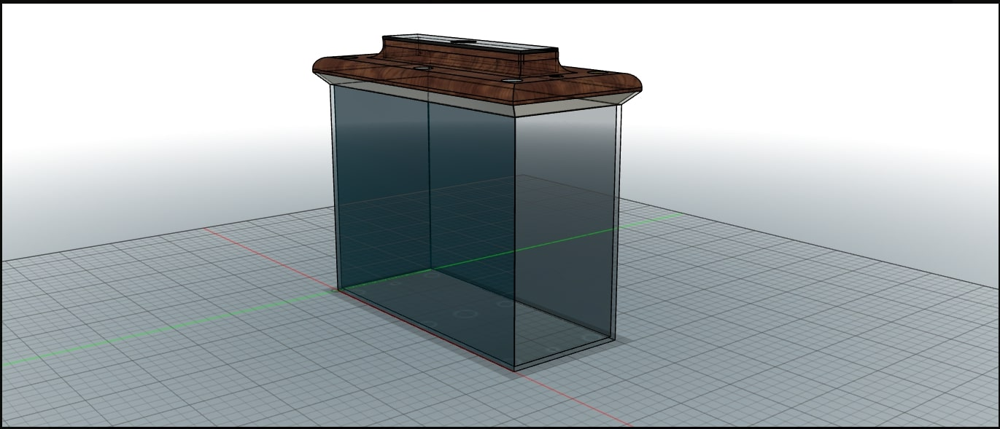
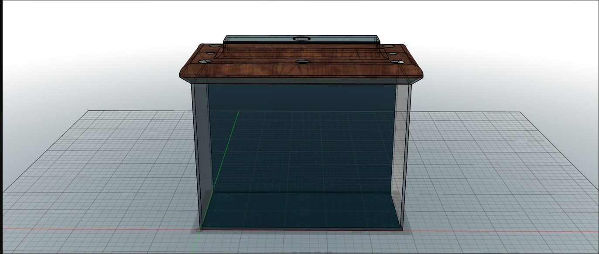
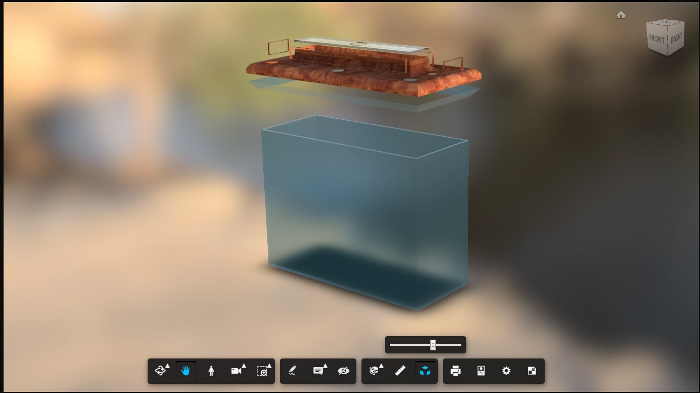

&nbsp;
# _Digital Media_
 &nbsp;

&nbsp;

&nbsp;

&nbsp;

&nbsp;

  I wanted to break into 3D modeling and had zero experience in it. I used an Auto Desk 360  trial for my first model. I had a sketch  an aquarium designed to have plants that could be inserted at the top. The plants are to provide an alternative to a filter by removing ammonia, all the while providing an increased environment for organisms.
